# TicketRush · Modelagem

Diagramas em Mermaid (o GitHub renderiza direto). Ordem de leitura: do mais geral (arquitetura) para o mais específico (classes e tabelas de cada serviço).

## Sumário

1. [Casos de uso](#1-casos-de-uso)
2. [Arquitetura de microsserviços](#2-arquitetura-de-microsserviços)
3. [Topologia do RabbitMQ](#3-topologia-do-rabbitmq)
4. [Mapa de mensagens entre serviços](#4-mapa-de-mensagens-entre-serviços)
5. [Estados do pedido e da reserva](#5-máquinas-de-estado)
6. [Sequências: compra feliz, pagamento tardio, webhook duplicado](#6-diagramas-de-sequência)
7. [Classes por serviço (UML)](#7-diagramas-de-classe-por-serviço)
8. [Modelo de dados por serviço (ER)](#8-modelo-de-dados-por-serviço)
9. [Implantação (Docker Compose)](#9-implantação-docker-compose)

---

## 1. Casos de uso

O Mermaid não tem diagrama de caso de uso nativo, então ele é representado com um flowchart: atores à esquerda, casos de uso agrupados pelo serviço responsável.

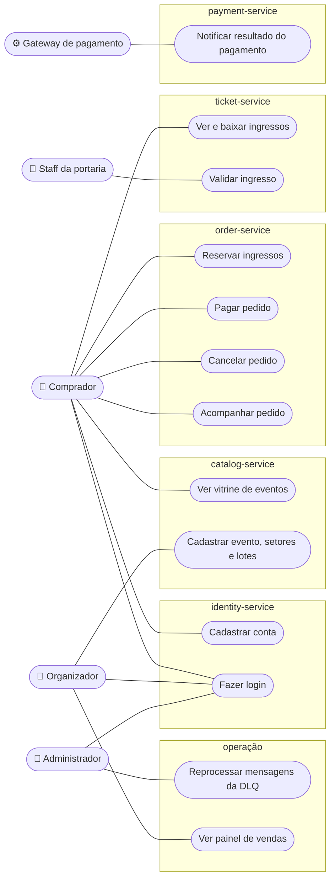
```mermaid
flowchart LR
    comprador(["👤 Comprador"])
    organizador(["👤 Organizador"])
    admin(["👤 Administrador"])
    portaria(["👤 Staff da portaria"])
    gateway(["⚙️ Gateway de pagamento"])

    subgraph identity["identity-service"]
        uc1(["Cadastrar conta"])
        uc2(["Fazer login"])
    end
    subgraph catalog["catalog-service"]
        uc3(["Ver vitrine de eventos"])
        uc4(["Cadastrar evento, setores e lotes"])
    end
    subgraph order["order-service"]
        uc5(["Reservar ingressos"])
        uc6(["Pagar pedido"])
        uc7(["Cancelar pedido"])
        uc8(["Acompanhar pedido"])
    end
    subgraph payment["payment-service"]
        uc9(["Notificar resultado do pagamento"])
    end
    subgraph ticket["ticket-service"]
        uc10(["Ver e baixar ingressos"])
        uc11(["Validar ingresso"])
    end
    subgraph ops["operação"]
        uc12(["Reprocessar mensagens da DLQ"])
        uc13(["Ver painel de vendas"])
    end

    comprador --- uc1 & uc2 & uc3 & uc5 & uc6 & uc7 & uc8 & uc10
    organizador --- uc2 & uc4 & uc13
    admin --- uc2 & uc12
    portaria --- uc11
    gateway --- uc9
```

---

## 2. Arquitetura de microsserviços

Visão de containers (nível 2 do modelo C4). Linha cheia = HTTP síncrono. Linha tracejada = mensagem assíncrona via RabbitMQ.

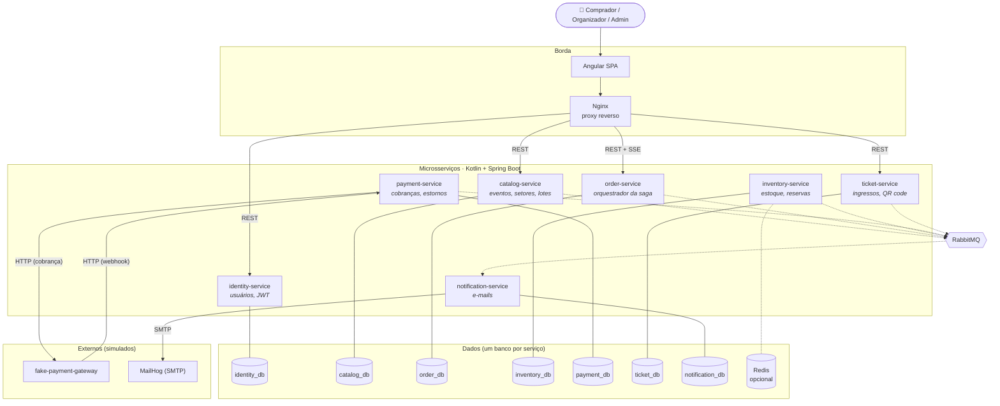
```mermaid
flowchart TB
    user(["👤 Comprador / Organizador / Admin"])

    subgraph edge["Borda"]
        web["Angular SPA"]
        nginx["Nginx<br/>proxy reverso"]
    end

    subgraph services["Microsserviços · Kotlin + Spring Boot"]
        identity["identity-service<br/><i>usuários, JWT</i>"]
        catalog["catalog-service<br/><i>eventos, setores, lotes</i>"]
        order["order-service<br/><i>orquestrador da saga</i>"]
        inventory["inventory-service<br/><i>estoque, reservas</i>"]
        payment["payment-service<br/><i>cobranças, estornos</i>"]
        ticket["ticket-service<br/><i>ingressos, QR code</i>"]
        notification["notification-service<br/><i>e-mails</i>"]
    end

    rabbit{{"RabbitMQ"}}

    subgraph data["Dados (um banco por serviço)"]
        db_id[("identity_db")]
        db_cat[("catalog_db")]
        db_ord[("order_db")]
        db_inv[("inventory_db")]
        db_pay[("payment_db")]
        db_tkt[("ticket_db")]
        db_not[("notification_db")]
        redis[("Redis<br/>opcional")]
    end

    subgraph external["Externos (simulados)"]
        gw["fake-payment-gateway"]
        mail["MailHog (SMTP)"]
    end

    user --> web --> nginx
    nginx -->|REST| identity
    nginx -->|REST| catalog
    nginx -->|REST + SSE| order
    nginx -->|REST| ticket

    catalog -.-> rabbit
    order -.-> rabbit
    inventory -.-> rabbit
    payment -.-> rabbit
    ticket -.-> rabbit
    rabbit -.-> notification

    payment -->|"HTTP (cobrança)"| gw
    gw -->|"HTTP (webhook)"| payment
    notification -->|SMTP| mail

    identity --- db_id
    catalog --- db_cat
    order --- db_ord
    inventory --- db_inv
    inventory -.- redis
    payment --- db_pay
    ticket --- db_tkt
    notification --- db_not
```

**Regras que o diagrama mostra:**

- Nenhum serviço acessa o banco de outro.
- O inventory não é exposto ao front: só recebe comandos pela fila.
- O notification só consome. Se ele cair, ninguém mais é afetado.

---

## 3. Topologia do RabbitMQ

Exchanges (hexágonos), filas (retângulos) e quem consome cada fila. As routing keys estão nas setas.

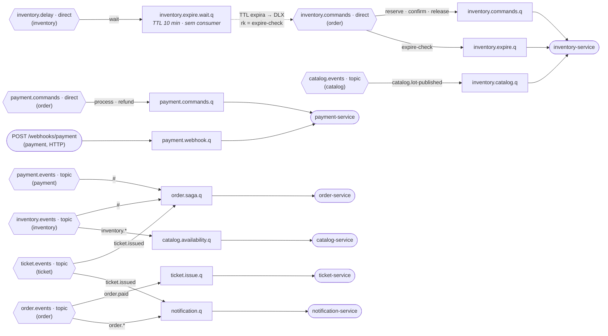
```mermaid
flowchart LR
    %% Exchanges (quem publica entre parênteses)
    X_invcmd{{"inventory.commands · direct<br/>(order)"}}
    X_paycmd{{"payment.commands · direct<br/>(order)"}}
    X_cat{{"catalog.events · topic<br/>(catalog)"}}
    X_inv{{"inventory.events · topic<br/>(inventory)"}}
    X_pay{{"payment.events · topic<br/>(payment)"}}
    X_tkt{{"ticket.events · topic<br/>(ticket)"}}
    X_ord{{"order.events · topic<br/>(order)"}}
    X_delay{{"inventory.delay · direct<br/>(inventory)"}}
    HOOK(["POST /webhooks/payment<br/>(payment, HTTP)"])

    %% Filas
    Q_invcmd["inventory.commands.q"]
    Q_exp["inventory.expire.q"]
    Q_wait["inventory.expire.wait.q<br/><i>TTL 10 min · sem consumer</i>"]
    Q_invcat["inventory.catalog.q"]
    Q_paycmd["payment.commands.q"]
    Q_hook["payment.webhook.q"]
    Q_saga["order.saga.q"]
    Q_tkt["ticket.issue.q"]
    Q_not["notification.q"]
    Q_proj["catalog.availability.q"]

    %% Consumidores
    C_inv(["inventory-service"])
    C_pay(["payment-service"])
    C_ord(["order-service"])
    C_tkt(["ticket-service"])
    C_not(["notification-service"])
    C_cat(["catalog-service"])

    X_invcmd -->|"reserve · confirm · release"| Q_invcmd --> C_inv
    X_invcmd -->|"expire-check"| Q_exp --> C_inv
    X_cat -->|"catalog.lot-published"| Q_invcat --> C_inv
    X_delay -->|"wait"| Q_wait
    Q_wait -.->|"TTL expira → DLX<br/>rk = expire-check"| X_invcmd

    X_paycmd -->|"process · refund"| Q_paycmd --> C_pay
    HOOK --> Q_hook --> C_pay

    X_inv -->|"#"| Q_saga
    X_pay -->|"#"| Q_saga
    X_tkt -->|"ticket.issued"| Q_saga
    Q_saga --> C_ord

    X_ord -->|"order.paid"| Q_tkt --> C_tkt

    X_ord -->|"order.*"| Q_not
    X_tkt -->|"ticket.issued"| Q_not
    Q_not --> C_not

    X_inv -->|"inventory.*"| Q_proj --> C_cat
```

Toda fila acima também tem `x-dead-letter-exchange = dlx`, que leva as mensagens mortas para a respectiva `*.dlq` (detalhe no próximo diagrama).

### Retry e DLQ de cada fila

Toda fila principal segue o mesmo padrão. O exemplo usa `ticket.issue.q`.

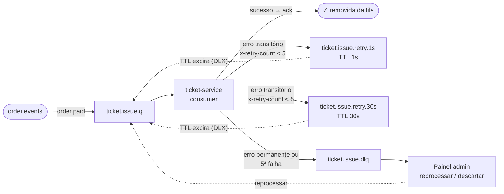
```mermaid
flowchart LR
    X(["order.events"]) -->|order.paid| Q["ticket.issue.q"]
    Q --> C["ticket-service<br/>consumer"]
    C -->|"sucesso → ack"| OK(["✓ removida da fila"])
    C -->|"erro transitório<br/>x-retry-count < 5"| R1["ticket.issue.retry.1s<br/>TTL 1s"]
    C -->|"erro transitório<br/>x-retry-count < 5"| R2["ticket.issue.retry.30s<br/>TTL 30s"]
    R1 -.->|"TTL expira (DLX)"| Q
    R2 -.->|"TTL expira (DLX)"| Q
    C -->|"erro permanente ou<br/>5ª falha"| DLQ["ticket.issue.dlq"]
    DLQ --> ADM["Painel admin<br/>reprocessar / descartar"]
    ADM -.->|reprocessar| Q
```

---

## 4. Mapa de mensagens entre serviços

Quem manda o quê para quem. Comandos (imperativo) têm 1 destino; eventos (passado) podem ter vários.

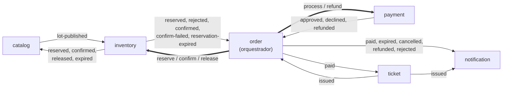
```mermaid
flowchart LR
    catalog["catalog"]
    order["order<br/>(orquestrador)"]
    inventory["inventory"]
    payment["payment"]
    ticket["ticket"]
    notification["notification"]

    catalog -- "lot-published" --> inventory
    order == "reserve / confirm / release" ==> inventory
    order == "process / refund" ==> payment
    inventory -- "reserved, rejected, confirmed,<br/>confirm-failed, reservation-expired" --> order
    inventory -- "reserved, confirmed,<br/>released, expired" --> catalog
    payment -- "approved, declined, refunded" --> order
    order -- "paid" --> ticket
    order -- "paid, expired, cancelled,<br/>refunded, rejected" --> notification
    ticket -- "issued" --> order
    ticket -- "issued" --> notification
```

Seta grossa (`==>`) = **comando**. Seta fina (`-->`) = **evento**.

---

## 5. Máquinas de estado

### 5.1 Pedido (order-service) · padrão State

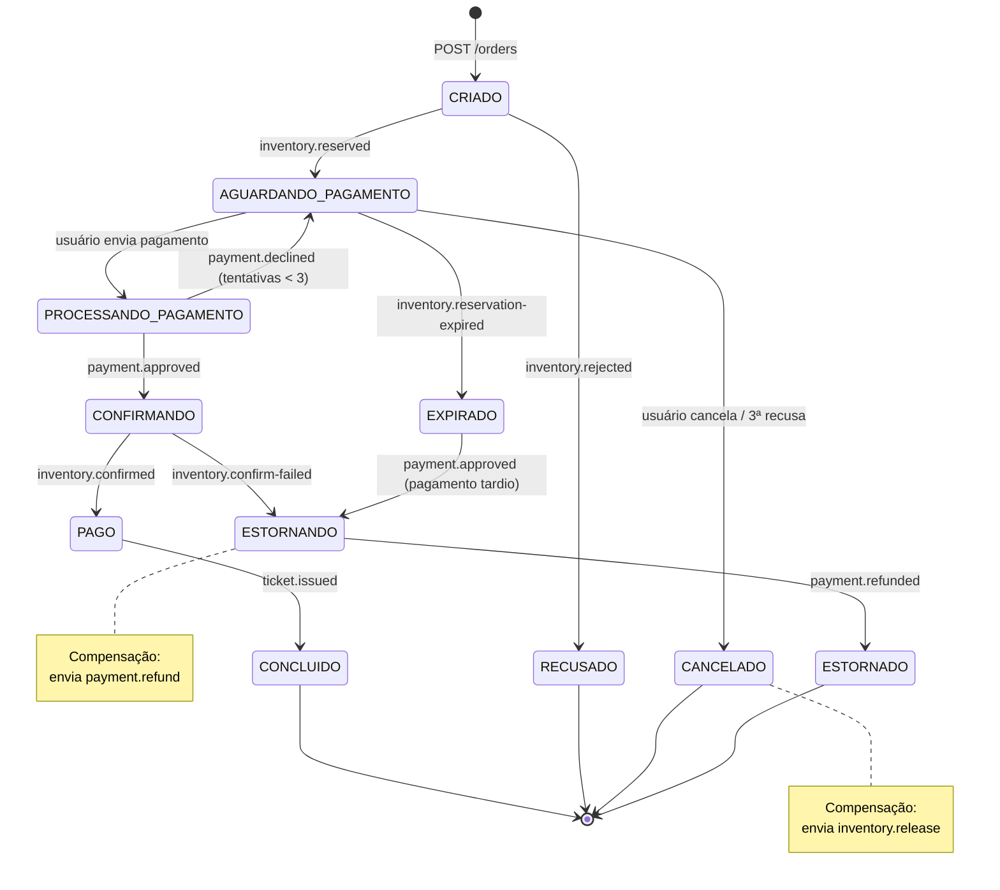
```mermaid
stateDiagram-v2
    [*] --> CRIADO: POST /orders

    CRIADO --> AGUARDANDO_PAGAMENTO: inventory.reserved
    CRIADO --> RECUSADO: inventory.rejected

    AGUARDANDO_PAGAMENTO --> PROCESSANDO_PAGAMENTO: usuário envia pagamento
    AGUARDANDO_PAGAMENTO --> EXPIRADO: inventory.reservation-expired
    AGUARDANDO_PAGAMENTO --> CANCELADO: usuário cancela / 3ª recusa

    PROCESSANDO_PAGAMENTO --> CONFIRMANDO: payment.approved
    PROCESSANDO_PAGAMENTO --> AGUARDANDO_PAGAMENTO: payment.declined (tentativas < 3)

    CONFIRMANDO --> PAGO: inventory.confirmed
    CONFIRMANDO --> ESTORNANDO: inventory.confirm-failed

    EXPIRADO --> ESTORNANDO: payment.approved (pagamento tardio)

    ESTORNANDO --> ESTORNADO: payment.refunded

    PAGO --> CONCLUIDO: ticket.issued

    CONCLUIDO --> [*]
    RECUSADO --> [*]
    CANCELADO --> [*]
    ESTORNADO --> [*]

    note right of CANCELADO
        Compensação:
        envia inventory.release
    end note
    note right of ESTORNANDO
        Compensação:
        envia payment.refund
    end note
```

Qualquer mensagem que não tenha transição a partir do estado atual é **ignorada com ack e registrada em log**. Ela é uma duplicata ou um atraso, não um erro.

### 5.2 Reserva (inventory-service)

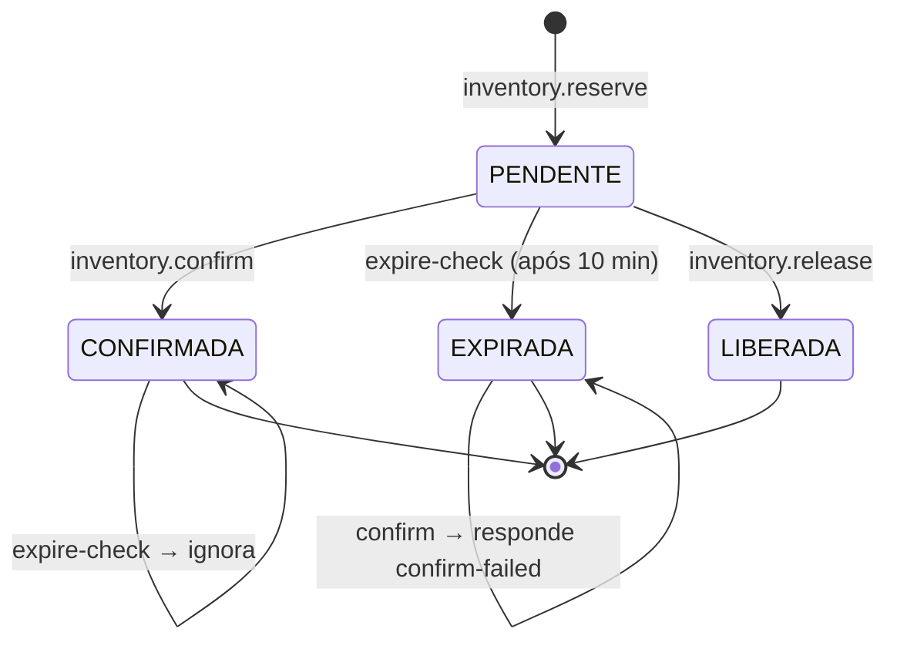
```mermaid
stateDiagram-v2
    [*] --> PENDENTE: inventory.reserve
    PENDENTE --> CONFIRMADA: inventory.confirm
    PENDENTE --> EXPIRADA: expire-check (após 10 min)
    PENDENTE --> LIBERADA: inventory.release
    EXPIRADA --> EXPIRADA: confirm → responde confirm-failed
    CONFIRMADA --> CONFIRMADA: expire-check → ignora
    CONFIRMADA --> [*]
    EXPIRADA --> [*]
    LIBERADA --> [*]
```

### 5.3 Pagamento (payment-service)

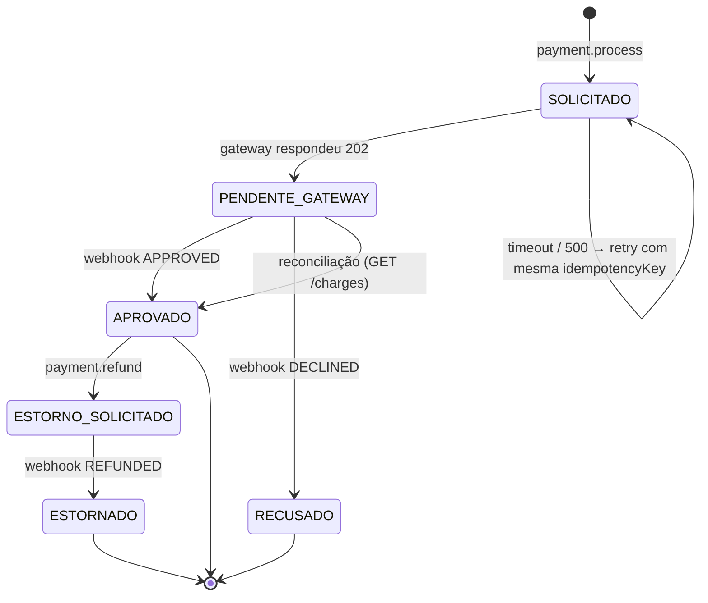
```mermaid
stateDiagram-v2
    [*] --> SOLICITADO: payment.process
    SOLICITADO --> PENDENTE_GATEWAY: gateway respondeu 202
    SOLICITADO --> SOLICITADO: timeout / 500 → retry com mesma idempotencyKey
    PENDENTE_GATEWAY --> APROVADO: webhook APPROVED
    PENDENTE_GATEWAY --> RECUSADO: webhook DECLINED
    PENDENTE_GATEWAY --> APROVADO: reconciliação (GET /charges)
    APROVADO --> ESTORNO_SOLICITADO: payment.refund
    ESTORNO_SOLICITADO --> ESTORNADO: webhook REFUNDED
    RECUSADO --> [*]
    ESTORNADO --> [*]
    APROVADO --> [*]
```

---

## 6. Diagramas de sequência

### 6.1 Compra com sucesso (Fluxo A)

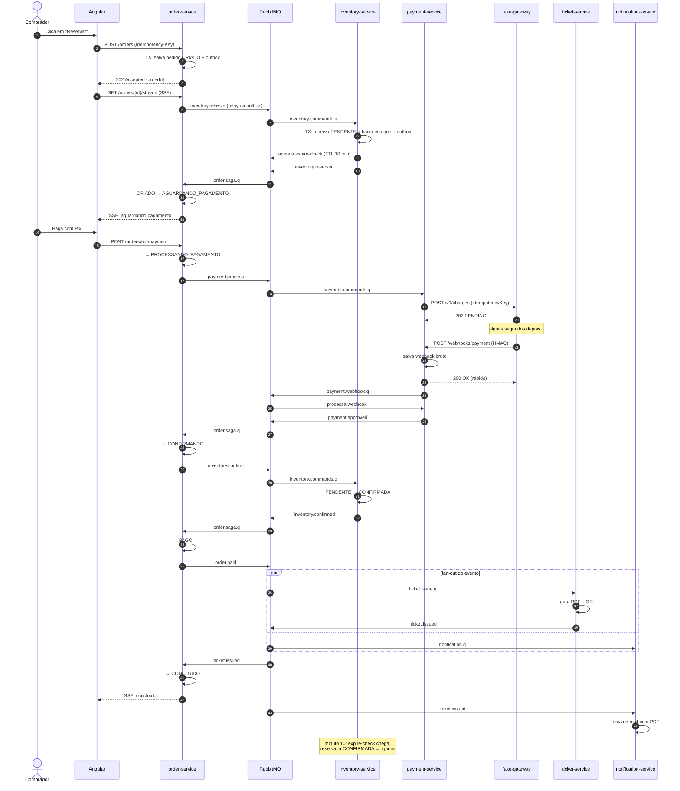
```mermaid
sequenceDiagram
    autonumber
    actor U as Comprador
    participant W as Angular
    participant O as order-service
    participant MQ as RabbitMQ
    participant I as inventory-service
    participant P as payment-service
    participant G as fake-gateway
    participant T as ticket-service
    participant N as notification-service

    U->>W: Clica em "Reservar"
    W->>O: POST /orders (Idempotency-Key)
    O->>O: TX: salva pedido CRIADO + outbox
    O-->>W: 202 Accepted {orderId}
    W->>O: GET /orders/{id}/stream (SSE)

    O->>MQ: inventory.reserve (relay da outbox)
    MQ->>I: inventory.commands.q
    I->>I: TX: reserva PENDENTE + baixa estoque + outbox
    I->>MQ: agenda expire-check (TTL 10 min)
    I->>MQ: inventory.reserved
    MQ->>O: order.saga.q
    O->>O: CRIADO → AGUARDANDO_PAGAMENTO
    O-->>W: SSE: aguardando pagamento

    U->>W: Paga com Pix
    W->>O: POST /orders/{id}/payment
    O->>O: → PROCESSANDO_PAGAMENTO
    O->>MQ: payment.process
    MQ->>P: payment.commands.q
    P->>G: POST /v1/charges (idempotencyKey)
    G-->>P: 202 PENDING

    Note over G: alguns segundos depois...
    G->>P: POST /webhooks/payment (HMAC)
    P->>P: salva webhook bruto
    P-->>G: 200 OK (rápido)
    P->>MQ: payment.webhook.q
    MQ->>P: processa webhook
    P->>MQ: payment.approved
    MQ->>O: order.saga.q
    O->>O: → CONFIRMANDO
    O->>MQ: inventory.confirm
    MQ->>I: inventory.commands.q
    I->>I: PENDENTE → CONFIRMADA
    I->>MQ: inventory.confirmed
    MQ->>O: order.saga.q
    O->>O: → PAGO
    O->>MQ: order.paid

    par fan-out do evento
        MQ->>T: ticket.issue.q
        T->>T: gera PDF + QR
        T->>MQ: ticket.issued
    and
        MQ->>N: notification.q
    end

    MQ->>O: ticket.issued
    O->>O: → CONCLUIDO
    O-->>W: SSE: concluído
    MQ->>N: ticket.issued
    N->>N: envia e-mail com PDF

    Note over I: minuto 10: expire-check chega,<br/>reserva já CONFIRMADA → ignora
```

### 6.2 Pagamento chega depois da expiração (Fluxo D)

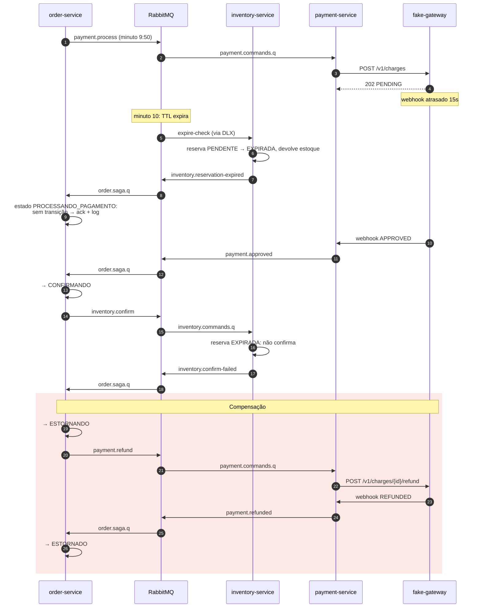
```mermaid
sequenceDiagram
    autonumber
    participant O as order-service
    participant MQ as RabbitMQ
    participant I as inventory-service
    participant P as payment-service
    participant G as fake-gateway

    O->>MQ: payment.process (minuto 9:50)
    MQ->>P: payment.commands.q
    P->>G: POST /v1/charges
    G-->>P: 202 PENDING
    Note over G: webhook atrasado 15s

    Note over MQ: minuto 10: TTL expira
    MQ->>I: expire-check (via DLX)
    I->>I: reserva PENDENTE → EXPIRADA, devolve estoque
    I->>MQ: inventory.reservation-expired
    MQ->>O: order.saga.q
    O->>O: estado PROCESSANDO_PAGAMENTO:<br/>sem transição → ack + log

    G->>P: webhook APPROVED
    P->>MQ: payment.approved
    MQ->>O: order.saga.q
    O->>O: → CONFIRMANDO
    O->>MQ: inventory.confirm
    MQ->>I: inventory.commands.q
    I->>I: reserva EXPIRADA: não confirma
    I->>MQ: inventory.confirm-failed
    MQ->>O: order.saga.q

    rect rgba(226, 70, 44, 0.12)
        Note over O,G: Compensação
        O->>O: → ESTORNANDO
        O->>MQ: payment.refund
        MQ->>P: payment.commands.q
        P->>G: POST /v1/charges/{id}/refund
        G->>P: webhook REFUNDED
        P->>MQ: payment.refunded
        MQ->>O: order.saga.q
        O->>O: → ESTORNADO
    end
```

### 6.3 Webhook duplicado e consumidor idempotente

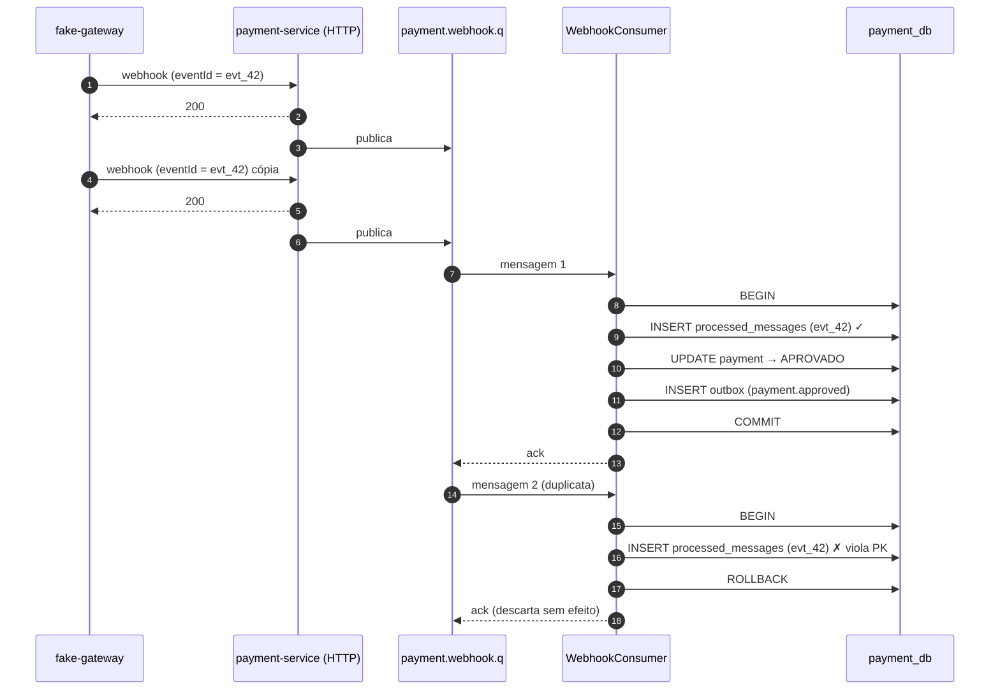
```mermaid
sequenceDiagram
    autonumber
    participant G as fake-gateway
    participant P as payment-service (HTTP)
    participant Q as payment.webhook.q
    participant C as WebhookConsumer
    participant DB as payment_db

    G->>P: webhook (eventId = evt_42)
    P-->>G: 200
    P->>Q: publica
    G->>P: webhook (eventId = evt_42) cópia
    P-->>G: 200
    P->>Q: publica

    Q->>C: mensagem 1
    C->>DB: BEGIN
    C->>DB: INSERT processed_messages (evt_42) ✓
    C->>DB: UPDATE payment → APROVADO
    C->>DB: INSERT outbox (payment.approved)
    C->>DB: COMMIT
    C-->>Q: ack

    Q->>C: mensagem 2 (duplicata)
    C->>DB: BEGIN
    C->>DB: INSERT processed_messages (evt_42) ✗ viola PK
    C->>DB: ROLLBACK
    C-->>Q: ack (descarta sem efeito)
```

### 6.4 Transactional Outbox

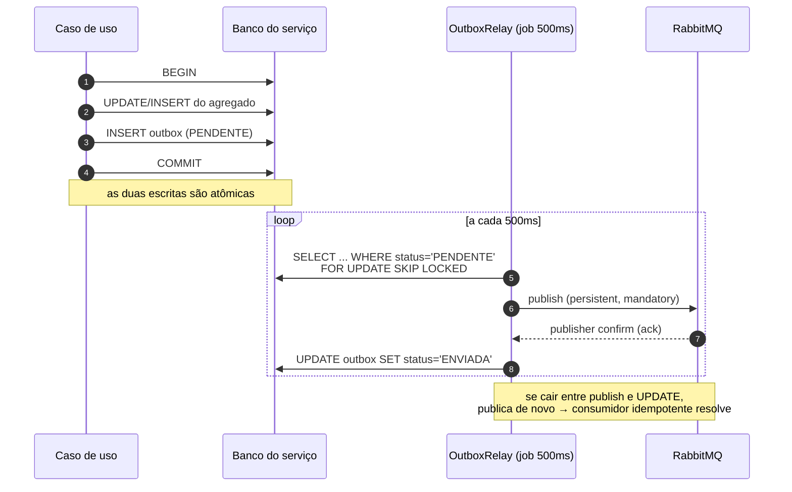
```mermaid
sequenceDiagram
    autonumber
    participant UC as Caso de uso
    participant DB as Banco do serviço
    participant R as OutboxRelay (job 500ms)
    participant MQ as RabbitMQ

    UC->>DB: BEGIN
    UC->>DB: UPDATE/INSERT do agregado
    UC->>DB: INSERT outbox (PENDENTE)
    UC->>DB: COMMIT
    Note over UC,DB: as duas escritas são atômicas

    loop a cada 500ms
        R->>DB: SELECT ... WHERE status='PENDENTE'<br/>FOR UPDATE SKIP LOCKED
        R->>MQ: publish (persistent, mandatory)
        MQ-->>R: publisher confirm (ack)
        R->>DB: UPDATE outbox SET status='ENVIADA'
    end
    Note over R,MQ: se cair entre publish e UPDATE,<br/>publica de novo → consumidor idempotente resolve
```

---

## 7. Diagramas de classe por serviço

Todos os serviços seguem arquitetura hexagonal. Classes com `<<port>>` são interfaces da camada de aplicação; `<<adapter>>` são implementações de infraestrutura.

### 7.1 Biblioteca compartilhada (`shared-messaging`)

Código comum a todos os serviços: envelope, outbox e o consumidor base com idempotência (**Template Method**).

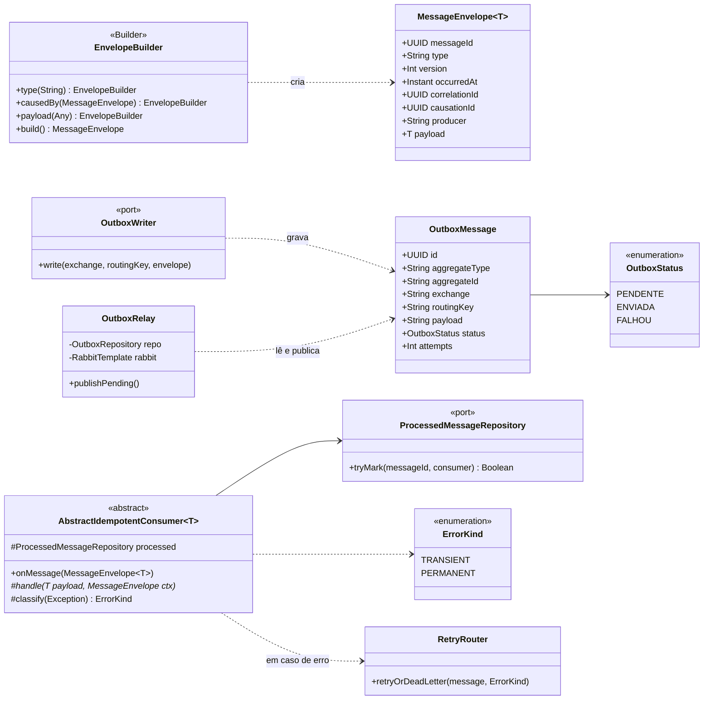
```mermaid
classDiagram
    direction LR

    class MessageEnvelope~T~ {
        +UUID messageId
        +String type
        +Int version
        +Instant occurredAt
        +UUID correlationId
        +UUID causationId
        +String producer
        +T payload
    }

    class EnvelopeBuilder {
        <<Builder>>
        +type(String) EnvelopeBuilder
        +causedBy(MessageEnvelope) EnvelopeBuilder
        +payload(Any) EnvelopeBuilder
        +build() MessageEnvelope
    }

    class OutboxMessage {
        +UUID id
        +String aggregateType
        +String aggregateId
        +String exchange
        +String routingKey
        +String payload
        +OutboxStatus status
        +Int attempts
    }

    class OutboxStatus {
        <<enumeration>>
        PENDENTE
        ENVIADA
        FALHOU
    }

    class OutboxWriter {
        <<port>>
        +write(exchange, routingKey, envelope)
    }

    class OutboxRelay {
        -OutboxRepository repo
        -RabbitTemplate rabbit
        +publishPending()
    }

    class ProcessedMessageRepository {
        <<port>>
        +tryMark(messageId, consumer) Boolean
    }

    class AbstractIdempotentConsumer~T~ {
        <<abstract>>
        #ProcessedMessageRepository processed
        +onMessage(MessageEnvelope~T~)
        #handle(T payload, MessageEnvelope ctx)*
        #classify(Exception) ErrorKind
    }

    class ErrorKind {
        <<enumeration>>
        TRANSIENT
        PERMANENT
    }

    class RetryRouter {
        +retryOrDeadLetter(message, ErrorKind)
    }

    EnvelopeBuilder ..> MessageEnvelope : cria
    OutboxWriter ..> OutboxMessage : grava
    OutboxMessage --> OutboxStatus
    OutboxRelay ..> OutboxMessage : lê e publica
    AbstractIdempotentConsumer --> ProcessedMessageRepository
    AbstractIdempotentConsumer ..> RetryRouter : em caso de erro
    AbstractIdempotentConsumer ..> ErrorKind
```

### 7.2 order-service

```mermaid
classDiagram
    direction TB

    class Order {
        <<Aggregate Root>>
        +UUID id
        +UUID userId
        +String userCpf
        +UUID eventId
        +List~OrderItem~ items
        +OrderState state
        +Money total
        +Int paymentAttempts
        +Long version
        +apply(OrderEvent) List~SagaAction~
    }

    class OrderItem {
        +UUID sectorId
        +UUID lotId
        +Int quantity
        +TicketType type
        +Money unitPrice
    }

    class TicketType {
        <<enumeration>>
        INTEIRA
        MEIA
    }

    class Money {
        <<Value Object>>
        +Long cents
        +String currency
        +plus(Money) Money
        +times(Int) Money
    }

    class OrderState {
        <<sealed interface>>
        +on(OrderEvent) Transition
    }
    class Criado
    class AguardandoPagamento
    class ProcessandoPagamento
    class Confirmando
    class Pago
    class Concluido
    class Expirado
    class Cancelado
    class Estornando
    class Estornado
    class Recusado

    class Transition {
        +OrderState next
        +List~SagaAction~ actions
        +ignore(state, event)$ Transition
    }

    class SagaAction {
        <<sealed interface>>
    }
    class SendReserve
    class SendProcessPayment
    class SendConfirm
    class SendRelease
    class SendRefund
    class PublishOrderEvent

    class OrderHistory {
        +UUID orderId
        +String from
        +String to
        +UUID causedByMessageId
        +Instant at
    }

    class PurchaseValidator {
        <<interface>>
        +validate(PurchaseRequest) ValidationResult
        +setNext(PurchaseValidator)
    }
    class EventPublishedValidator
    class LotActiveValidator
    class CpfLimitValidator
    class HalfPriceQuotaValidator
    class NoPendingOrderValidator

    class CreateOrderUseCase {
        +execute(PurchaseRequest, idempotencyKey) Order
    }
    class HandleSagaEventUseCase {
        +execute(OrderEvent)
    }
    class OrderRepository {
        <<port>>
    }
    class InventoryCommandSender {
        <<port>>
    }
    class PaymentCommandSender {
        <<port>>
    }
    class OrderEventPublisher {
        <<port>>
    }
    class OrderStatusNotifier {
        <<port>>
        +push(orderId, state)
    }
    class SseOrderStatusNotifier {
        <<adapter>>
    }
    class SagaEventConsumer {
        <<adapter>>
    }

    Order "1" *-- "1..4" OrderItem
    Order --> OrderState
    OrderItem --> TicketType
    OrderItem --> Money
    Order --> Money

    OrderState <|.. Criado
    OrderState <|.. AguardandoPagamento
    OrderState <|.. ProcessandoPagamento
    OrderState <|.. Confirmando
    OrderState <|.. Pago
    OrderState <|.. Concluido
    OrderState <|.. Expirado
    OrderState <|.. Cancelado
    OrderState <|.. Estornando
    OrderState <|.. Estornado
    OrderState <|.. Recusado
    OrderState ..> Transition
    Transition --> SagaAction

    SagaAction <|.. SendReserve
    SagaAction <|.. SendProcessPayment
    SagaAction <|.. SendConfirm
    SagaAction <|.. SendRelease
    SagaAction <|.. SendRefund
    SagaAction <|.. PublishOrderEvent

    PurchaseValidator <|.. EventPublishedValidator
    PurchaseValidator <|.. LotActiveValidator
    PurchaseValidator <|.. CpfLimitValidator
    PurchaseValidator <|.. HalfPriceQuotaValidator
    PurchaseValidator <|.. NoPendingOrderValidator
    PurchaseValidator --> PurchaseValidator : next

    CreateOrderUseCase --> PurchaseValidator
    CreateOrderUseCase --> OrderRepository
    CreateOrderUseCase --> InventoryCommandSender
    HandleSagaEventUseCase --> OrderRepository
    HandleSagaEventUseCase --> InventoryCommandSender
    HandleSagaEventUseCase --> PaymentCommandSender
    HandleSagaEventUseCase --> OrderEventPublisher
    HandleSagaEventUseCase --> OrderStatusNotifier
    HandleSagaEventUseCase ..> OrderHistory : grava
    OrderStatusNotifier <|.. SseOrderStatusNotifier
    SagaEventConsumer --> HandleSagaEventUseCase
```

Padrões visíveis: **State** (`OrderState` + `Transition`), **Chain of Responsibility** (`PurchaseValidator`), **Command** (`SagaAction`), **Ports & Adapters** (DIP).

### 7.3 inventory-service

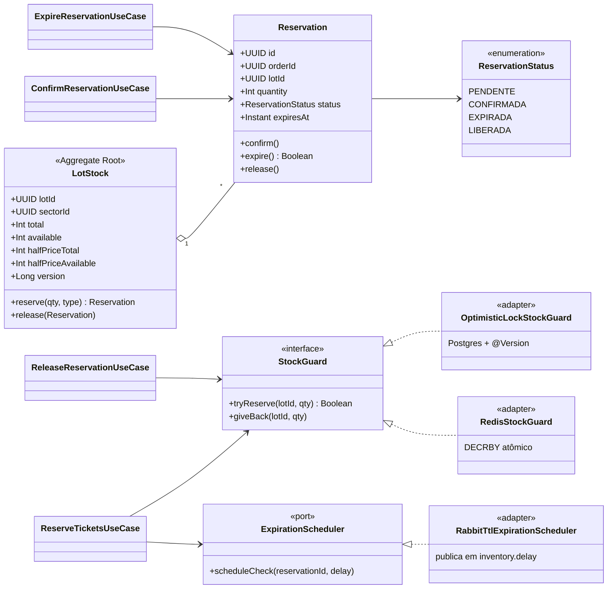
```mermaid
classDiagram
    direction LR

    class LotStock {
        <<Aggregate Root>>
        +UUID lotId
        +UUID sectorId
        +Int total
        +Int available
        +Int halfPriceTotal
        +Int halfPriceAvailable
        +Long version
        +reserve(qty, type) Reservation
        +release(Reservation)
    }

    class Reservation {
        +UUID id
        +UUID orderId
        +UUID lotId
        +Int quantity
        +ReservationStatus status
        +Instant expiresAt
        +confirm()
        +expire() Boolean
        +release()
    }

    class ReservationStatus {
        <<enumeration>>
        PENDENTE
        CONFIRMADA
        EXPIRADA
        LIBERADA
    }

    class StockGuard {
        <<interface>>
        +tryReserve(lotId, qty) Boolean
        +giveBack(lotId, qty)
    }
    class OptimisticLockStockGuard {
        <<adapter>>
        Postgres + @Version
    }
    class RedisStockGuard {
        <<adapter>>
        DECRBY atômico
    }

    class ReserveTicketsUseCase
    class ConfirmReservationUseCase
    class ExpireReservationUseCase
    class ReleaseReservationUseCase
    class ExpirationScheduler {
        <<port>>
        +scheduleCheck(reservationId, delay)
    }
    class RabbitTtlExpirationScheduler {
        <<adapter>>
        publica em inventory.delay
    }

    LotStock "1" o-- "*" Reservation
    Reservation --> ReservationStatus
    StockGuard <|.. OptimisticLockStockGuard
    StockGuard <|.. RedisStockGuard
    ReserveTicketsUseCase --> StockGuard
    ReserveTicketsUseCase --> ExpirationScheduler
    ExpirationScheduler <|.. RabbitTtlExpirationScheduler
    ConfirmReservationUseCase --> Reservation
    ExpireReservationUseCase --> Reservation
    ReleaseReservationUseCase --> StockGuard
```

`StockGuard` é uma **Strategy**: troque Postgres por Redis na Fase 5 sem tocar no caso de uso (Liskov + Open/Closed).

### 7.4 payment-service

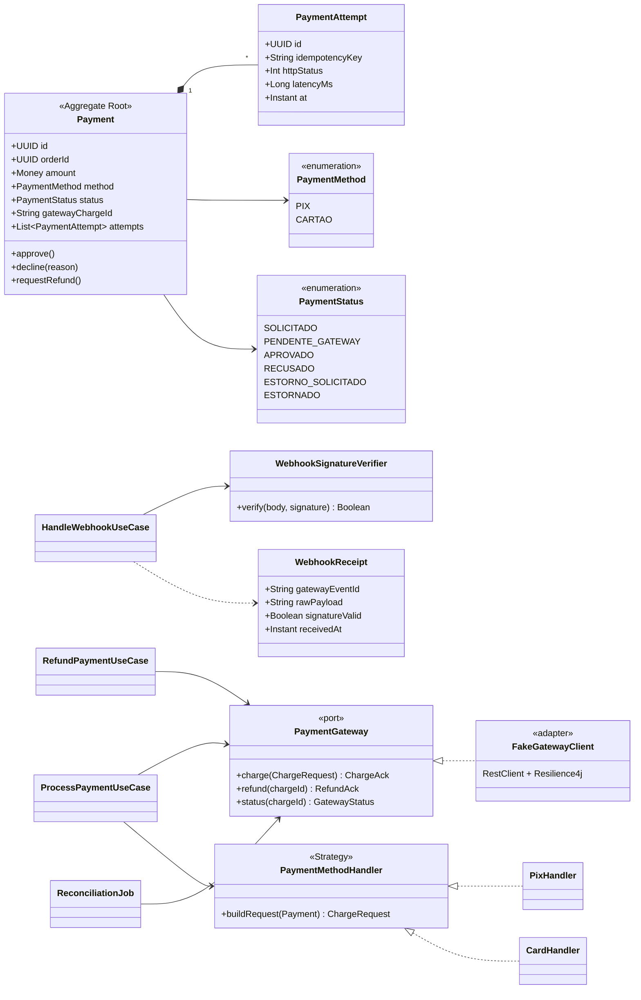
```mermaid
classDiagram
    direction LR

    class Payment {
        <<Aggregate Root>>
        +UUID id
        +UUID orderId
        +Money amount
        +PaymentMethod method
        +PaymentStatus status
        +String gatewayChargeId
        +List~PaymentAttempt~ attempts
        +approve()
        +decline(reason)
        +requestRefund()
    }

    class PaymentAttempt {
        +UUID id
        +String idempotencyKey
        +Int httpStatus
        +Long latencyMs
        +Instant at
    }

    class WebhookReceipt {
        +String gatewayEventId
        +String rawPayload
        +Boolean signatureValid
        +Instant receivedAt
    }

    class PaymentMethod {
        <<enumeration>>
        PIX
        CARTAO
    }

    class PaymentStatus {
        <<enumeration>>
        SOLICITADO
        PENDENTE_GATEWAY
        APROVADO
        RECUSADO
        ESTORNO_SOLICITADO
        ESTORNADO
    }

    class PaymentGateway {
        <<port>>
        +charge(ChargeRequest) ChargeAck
        +refund(chargeId) RefundAck
        +status(chargeId) GatewayStatus
    }
    class FakeGatewayClient {
        <<adapter>>
        RestClient + Resilience4j
    }

    class PaymentMethodHandler {
        <<Strategy>>
        +buildRequest(Payment) ChargeRequest
    }
    class PixHandler
    class CardHandler

    class WebhookSignatureVerifier {
        +verify(body, signature) Boolean
    }

    class ProcessPaymentUseCase
    class HandleWebhookUseCase
    class RefundPaymentUseCase
    class ReconciliationJob

    Payment "1" *-- "*" PaymentAttempt
    Payment --> PaymentMethod
    Payment --> PaymentStatus
    PaymentGateway <|.. FakeGatewayClient
    PaymentMethodHandler <|.. PixHandler
    PaymentMethodHandler <|.. CardHandler
    ProcessPaymentUseCase --> PaymentGateway
    ProcessPaymentUseCase --> PaymentMethodHandler
    HandleWebhookUseCase --> WebhookSignatureVerifier
    HandleWebhookUseCase ..> WebhookReceipt
    RefundPaymentUseCase --> PaymentGateway
    ReconciliationJob --> PaymentGateway
```

`FakeGatewayClient` é um **Adapter**: converte o formato do gateway externo para o domínio. Um futuro `MercadoPagoClient` entra no lugar sem mudar os casos de uso.

### 7.5 ticket-service e notification-service

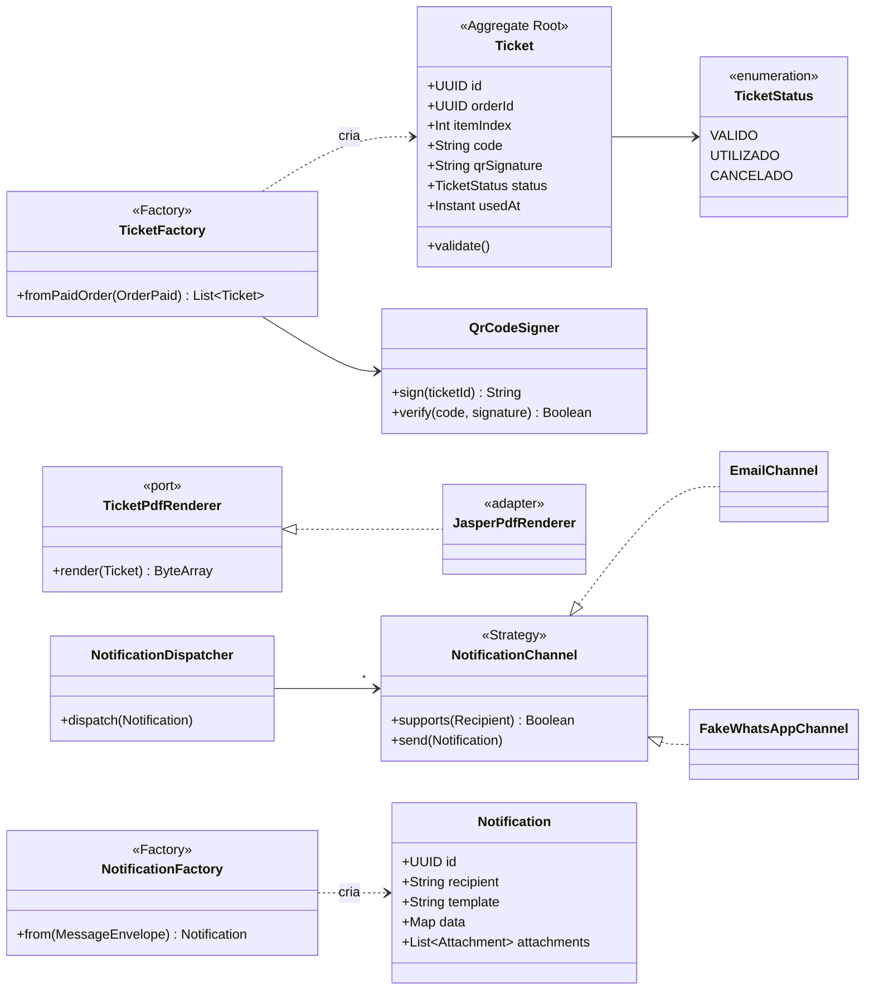
```mermaid
classDiagram
    direction LR

    class Ticket {
        <<Aggregate Root>>
        +UUID id
        +UUID orderId
        +Int itemIndex
        +String code
        +String qrSignature
        +TicketStatus status
        +Instant usedAt
        +validate()
    }
    class TicketStatus {
        <<enumeration>>
        VALIDO
        UTILIZADO
        CANCELADO
    }
    class TicketFactory {
        <<Factory>>
        +fromPaidOrder(OrderPaid) List~Ticket~
    }
    class QrCodeSigner {
        +sign(ticketId) String
        +verify(code, signature) Boolean
    }
    class TicketPdfRenderer {
        <<port>>
        +render(Ticket) ByteArray
    }
    class JasperPdfRenderer {
        <<adapter>>
    }

    Ticket --> TicketStatus
    TicketFactory ..> Ticket : cria
    TicketFactory --> QrCodeSigner
    TicketPdfRenderer <|.. JasperPdfRenderer

    class NotificationChannel {
        <<Strategy>>
        +supports(Recipient) Boolean
        +send(Notification)
    }
    class EmailChannel
    class FakeWhatsAppChannel
    class Notification {
        +UUID id
        +String recipient
        +String template
        +Map data
        +List~Attachment~ attachments
    }
    class NotificationFactory {
        <<Factory>>
        +from(MessageEnvelope) Notification
    }
    class NotificationDispatcher {
        +dispatch(Notification)
    }

    NotificationChannel <|.. EmailChannel
    NotificationChannel <|.. FakeWhatsAppChannel
    NotificationFactory ..> Notification : cria
    NotificationDispatcher --> "*" NotificationChannel
```

### 7.6 catalog-service e identity-service

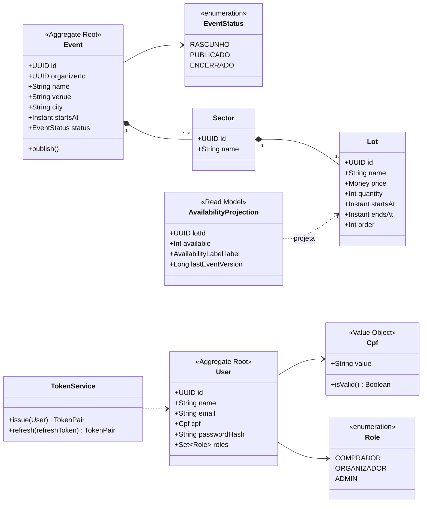
```mermaid
classDiagram
    direction LR

    class Event {
        <<Aggregate Root>>
        +UUID id
        +UUID organizerId
        +String name
        +String venue
        +String city
        +Instant startsAt
        +EventStatus status
        +publish()
    }
    class EventStatus {
        <<enumeration>>
        RASCUNHO
        PUBLICADO
        ENCERRADO
    }
    class Sector {
        +UUID id
        +String name
    }
    class Lot {
        +UUID id
        +String name
        +Money price
        +Int quantity
        +Instant startsAt
        +Instant endsAt
        +Int order
    }
    class AvailabilityProjection {
        <<Read Model>>
        +UUID lotId
        +Int available
        +AvailabilityLabel label
        +Long lastEventVersion
    }

    Event "1" *-- "1..*" Sector
    Sector "1" *-- "1..*" Lot
    Event --> EventStatus
    AvailabilityProjection ..> Lot : projeta

    class User {
        <<Aggregate Root>>
        +UUID id
        +String name
        +String email
        +Cpf cpf
        +String passwordHash
        +Set~Role~ roles
    }
    class Cpf {
        <<Value Object>>
        +String value
        +isValid() Boolean
    }
    class Role {
        <<enumeration>>
        COMPRADOR
        ORGANIZADOR
        ADMIN
    }
    class TokenService {
        +issue(User) TokenPair
        +refresh(refreshToken) TokenPair
    }

    User --> Cpf
    User --> Role
    TokenService ..> User
```

---

## 8. Modelo de dados por serviço

Cada bloco é um **banco separado**. Repare que não existe FK entre bancos: `order_id` no payment_db é só um UUID, sem constraint.

### 8.1 order_db

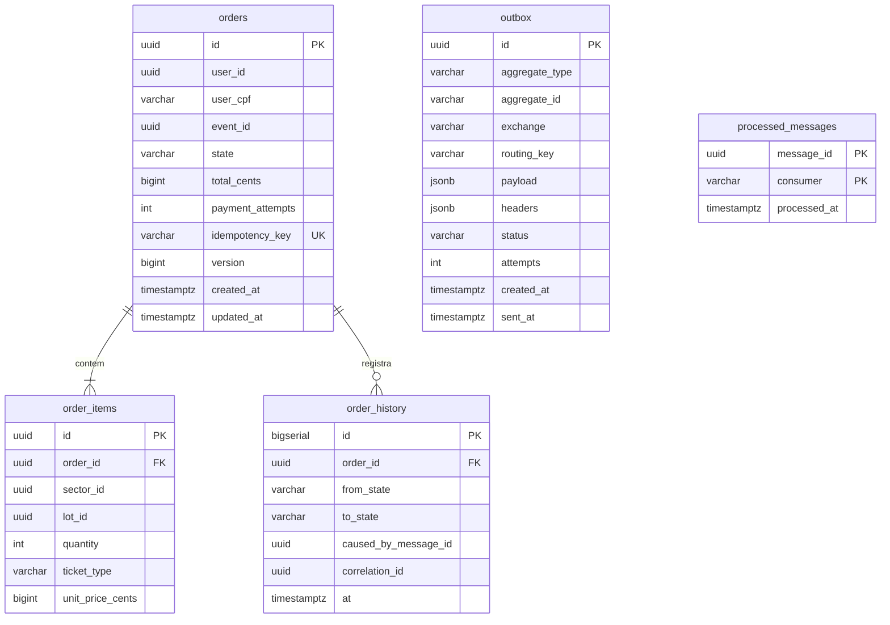
```mermaid
erDiagram
    orders ||--|{ order_items : contem
    orders ||--o{ order_history : registra

    orders {
        uuid id PK
        uuid user_id
        varchar user_cpf
        uuid event_id
        varchar state
        bigint total_cents
        int payment_attempts
        varchar idempotency_key UK
        bigint version
        timestamptz created_at
        timestamptz updated_at
    }
    order_items {
        uuid id PK
        uuid order_id FK
        uuid sector_id
        uuid lot_id
        int quantity
        varchar ticket_type
        bigint unit_price_cents
    }
    order_history {
        bigserial id PK
        uuid order_id FK
        varchar from_state
        varchar to_state
        uuid caused_by_message_id
        uuid correlation_id
        timestamptz at
    }
    outbox {
        uuid id PK
        varchar aggregate_type
        varchar aggregate_id
        varchar exchange
        varchar routing_key
        jsonb payload
        jsonb headers
        varchar status
        int attempts
        timestamptz created_at
        timestamptz sent_at
    }
    processed_messages {
        uuid message_id PK
        varchar consumer PK
        timestamptz processed_at
    }
```

> `outbox` e `processed_messages` existem em **todo** banco de serviço que publica ou consome mensagens. Elas aparecem só aqui para não repetir.

### 8.2 inventory_db

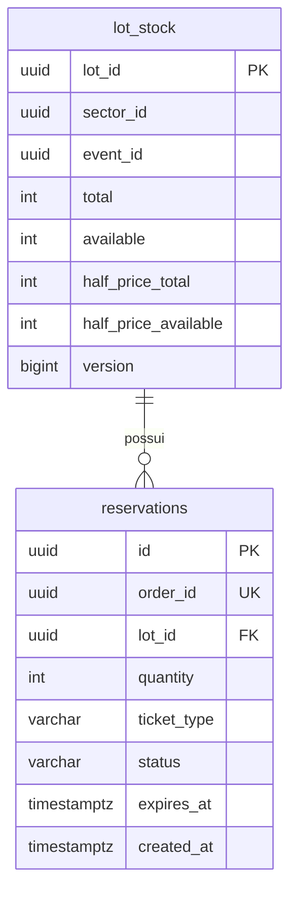
```mermaid
erDiagram
    lot_stock ||--o{ reservations : possui

    lot_stock {
        uuid lot_id PK
        uuid sector_id
        uuid event_id
        int total
        int available
        int half_price_total
        int half_price_available
        bigint version
    }
    reservations {
        uuid id PK
        uuid order_id UK
        uuid lot_id FK
        int quantity
        varchar ticket_type
        varchar status
        timestamptz expires_at
        timestamptz created_at
    }
```

### 8.3 payment_db

```mermaid
erDiagram
    payments ||--|{ payment_attempts : tem

    payments {
        uuid id PK
        uuid order_id
        bigint amount_cents
        varchar method
        varchar status
        varchar gateway_charge_id UK
        timestamptz created_at
        timestamptz updated_at
    }
    payment_attempts {
        uuid id PK
        uuid payment_id FK
        varchar idempotency_key UK
        int http_status
        bigint latency_ms
        timestamptz at
    }
    webhook_receipts {
        varchar gateway_event_id PK
        varchar gateway_charge_id
        jsonb raw_payload
        boolean signature_valid
        timestamptz received_at
    }
```

### 8.4 catalog_db, ticket_db, identity_db, notification_db

```mermaid
erDiagram
    events ||--|{ sectors : tem
    sectors ||--|{ lots : tem
    lots ||--|| availability_projection : projeta

    events {
        uuid id PK
        uuid organizer_id
        varchar name
        varchar venue
        varchar city
        timestamptz starts_at
        varchar status
    }
    sectors {
        uuid id PK
        uuid event_id FK
        varchar name
    }
    lots {
        uuid id PK
        uuid sector_id FK
        varchar name
        bigint price_cents
        int quantity
        int sort_order
        timestamptz starts_at
        timestamptz ends_at
    }
    availability_projection {
        uuid lot_id PK
        int available
        varchar label
        bigint last_event_version
    }

    tickets {
        uuid id PK
        uuid order_id
        int item_index
        varchar code UK
        varchar qr_signature
        varchar status
        varchar pdf_path
        timestamptz issued_at
        timestamptz used_at
    }

    users {
        uuid id PK
        varchar name
        varchar email UK
        varchar cpf UK
        varchar password_hash
        varchar roles
        timestamptz created_at
    }

    notifications {
        uuid id PK
        uuid correlation_id
        varchar channel
        varchar recipient
        varchar template
        varchar status
        int attempts
        timestamptz sent_at
    }
```

`tickets` tem constraint única em `(order_id, item_index)`: é ela que impede ingressos duplicados quando o `order.paid` chega duas vezes.

---

## 9. Implantação (Docker Compose)

```mermaid
flowchart TB
    subgraph host["docker compose · rede ticketrush"]
        nginx["nginx<br/>:80"]
        subgraph apps["serviços (Kotlin/Spring)"]
            identity["identity-service :8081"]
            catalog["catalog-service :8082"]
            order["order-service :8083"]
            inventory["inventory-service :8084"]
            payment["payment-service :8085"]
            ticket["ticket-service :8086<br/><i>scale: 1..3</i>"]
            notification["notification-service :8087"]
            gateway["fake-gateway :8090"]
        end
        subgraph infra["infraestrutura"]
            pg[("postgres :5432<br/>7 databases")]
            rmq{{"rabbitmq :5672<br/>management :15672"}}
            redis[("redis :6379")]
            mailhog["mailhog<br/>smtp :1025 · ui :8025"]
        end
        subgraph obs["observabilidade (opcional)"]
            prom["prometheus :9090"]
            graf["grafana :3000"]
        end
    end

    browser(["Navegador"]) --> nginx
    nginx --> identity & catalog & order & ticket
    apps --> pg
    apps --> rmq
    inventory --> redis
    notification --> mailhog
    payment <--> gateway
    prom --> apps
    prom --> rmq
    graf --> prom
```
